# CBT Platform — Client Architecture & Workflow Document

**Document type:** Solution architecture (client-ready)  
**Scope:** NCERT-aligned institute CBT platform (Classes 9–12) — multi-tenant examination management, class tests, AI generation, proctoring, and results  
**Source of truth:** Repository documentation (`USER-WORKFLOW-GUIDE.md`, `01-system-architecture.md` through `13-deployment-architecture.md`, and related API/RBAC/security references)

---

## Document Purpose

This document consolidates the **technical architecture** and **operational workflows** of the CBT (Computer-Based Test) Platform for client delivery. It is intended for stakeholders, solution architects, security reviewers, and implementation teams. Visual models use Mermaid syntax (renderable in GitHub, GitLab, and most markdown viewers). Each diagram is accompanied by narrative descriptions of processes, data transformations, and decision points.

---

## System Overview

### Product Definition

The **Computer-Based Test (CBT) Platform** is an NCERT-aligned institute system for Classes 9–12. Institutes upload textbooks, organize **classes and batches**, track **syllabus progress**, generate **AI class tests**, assign **students**, run **proctored exams**, and publish **results** and certificates.

**Primary login (local development):** `http://localhost:3002/login`

### Architectural Positioning

The platform is a **cloud-native, multi-tenant examination management system** built on a **modular monolith with microservice extraction points**. This hybrid design supports rapid institute onboarding while allowing independent scaling of compute-intensive services (AI proctoring, code execution) toward **1M+ concurrent users** (design target).

### Architectural Principles

| Principle | Implementation |
|-----------|----------------|
| Multi-tenancy | Schema-per-tenant (default) or database-per-tenant (enterprise) |
| Security-first | Zero-trust, defense-in-depth, OWASP Top 10 alignment |
| Event-driven | Redis pub/sub + SQS for async proctoring and evaluation |
| CQRS-lite | Writes to primary DB; reads from replicas + Redis cache |
| Observability | Structured logging, distributed tracing, real-time metrics |
| Resilience | Circuit breakers, bulkheads, graceful degradation |

### System Layers

```text
┌─────────────────────────────────────────────────────────────────────────┐
│                         PRESENTATION LAYER                              │
│  Next.js 15 (SSR/SSG) │ Exam Client (SPA) │ Proctor Dashboard │ Mobile  │
└─────────────────────────────────────────────────────────────────────────┘
                                    │
                          Cloudflare CDN + WAF
                                    │
┌─────────────────────────────────────────────────────────────────────────┐
│                          API GATEWAY LAYER                              │
│  Nginx Ingress │ Rate Limiting │ TLS Termination │ JWT Validation       │
└─────────────────────────────────────────────────────────────────────────┘
                                    │
┌─────────────────────────────────────────────────────────────────────────┐
│                        APPLICATION LAYER (NestJS)                       │
│  Auth │ Candidates │ Questions │ Exams │ CBT Engine │ Results │ Analytics│
│  Security │ Proctoring │ Coding │ Notifications │ Audit │ Tenant Mgmt    │
└─────────────────────────────────────────────────────────────────────────┘
                                    │
┌──────────────────────┬──────────────────────┬───────────────────────────┐
│   DATA LAYER         │   CACHE LAYER        │   MESSAGE LAYER           │
│   PostgreSQL 16      │   Redis Cluster      │   AWS SQS / Redis Streams │
│   (Primary + Replica)│   (Sessions, Cache)  │   (Async Events)          │
│   S3 (Documents)     │                      │                           │
└──────────────────────┴──────────────────────┴───────────────────────────┘
                                    │
┌─────────────────────────────────────────────────────────────────────────┐
│                      SPECIALIZED SERVICES                               │
│  AI Proctoring (GPU) │ Code Sandbox (gVisor) │ PDF Generator │ Email    │
└─────────────────────────────────────────────────────────────────────────┘
```

### Technology Stack (Reference)

| Layer | Technologies |
|-------|----------------|
| Frontend | Next.js 15, React, TypeScript, Tailwind CSS, Shadcn UI, Zustand, React Query |
| Core API | NestJS, Prisma, PostgreSQL, Redis, Socket.IO |
| Specialized | Python/FastAPI AI proctoring (ONNX/GPU); Node.js code sandbox (gVisor) |
| Infrastructure | Docker, Kubernetes, AWS, Cloudflare, Nginx |
| Security | JWT, MFA, RBAC, AES-256, device fingerprinting, audit logging |

### Non-Functional Requirements (Design Targets)

| Metric | Target |
|--------|--------|
| Concurrent users | 1,000,000+ |
| API latency (p99) | < 200 ms |
| Exam auto-save | < 100 ms |
| Proctoring inference | < 500 ms |
| Uptime SLA | 99.99% |
| RPO | < 1 minute |
| RTO | < 15 minutes |
| Data retention | Configurable per tenant (GDPR-oriented) |

---

## User Roles, Portals, and Access Model

### Institute-Facing Role Types (Product UX)

The product exposes three primary **portal experiences** (role types). User counts per institute grow per tenant; the table describes **roles**, not fixed population sizes.

| # | Role | Portal | Default route after login | Demo account (seed) |
|---|------|--------|---------------------------|---------------------|
| 1 | Super Admin | Full dashboard | `/dashboard` | `admin@cbt-platform.com` / `Admin@123` |
| 2 | Teacher | Teacher portal | `/dashboard/teacher` | `teacher@example.com` / `Teacher@123` |
| 3 | Candidate / Student | Student portal | `/my-exams` | `candidate@example.com` / `Candidate@123` |

### Platform-Only Capability

**Institutes (multi-tenant platform admin)** — route `/dashboard/institutes`, permission `tenant:create` — allows Super Admin to list and create schools/coaching institutes (tenants). This is explicitly **platform-level** administration, distinct from single-institute configuration.

### Extended RBAC (Backend Authorization)

The authorization layer defines **eight system roles** and **120+ granular permissions** (pattern `{module}:{action}`). Institute UX maps primarily to Super Admin and Teacher on the staff dashboard; candidates use the student portal only.

| Role | Scope | Description |
|------|-------|-------------|
| SUPER_ADMIN | Global | Platform-wide administration, tenant management |
| ORG_ADMIN | Tenant | Organization settings, user management |
| EXAM_MANAGER | Tenant | Exam creation, scheduling, candidate assignment |
| QUESTION_MODERATOR | Tenant | Question bank CRUD, approval workflow |
| PROCTOR | Exam | Live monitoring, violation management |
| EVALUATOR | Exam | Manual evaluation of subjective answers |
| CANDIDATE | Self | Take exams, view results, manage profile |
| AUDITOR | Tenant | Read-only audit logs, compliance reports |

**Tenant resolution:** Incoming requests resolve tenant by **custom domain** or **`X-Tenant-ID` header**, then apply isolation mode (schema-per-tenant, dedicated DB, or row-level security with `tenant_id`).

---

## Business Workflows and Process Flowcharts

### End-to-End Institute Lifecycle (All Roles)

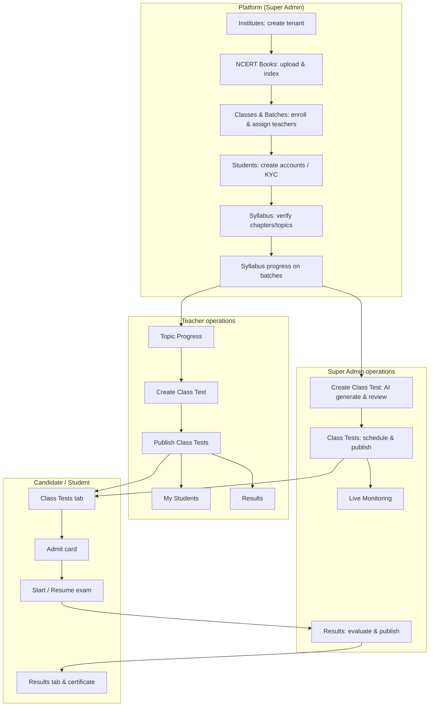

**Narrative**

1. **Platform bootstrap:** Super Admin creates institutes (`/dashboard/institutes`) when operating as platform operator; within a tenant, onboarding follows **School Setup** (`/dashboard/setup`) checklist.
2. **Content foundation:** NCERT PDFs upload to **NCERT Books** (`/dashboard/materials`); system **indexes** materials into chapters/topics for syllabus and AI context.
3. **Organization:** **Classes & Batches** define academic structure, enrollment, teacher-subject assignment, and **syllabus progress**.
4. **People:** **Students** (`/dashboard/candidates`) are created and linked to batches; KYC may gate exam access per institute policy.
5. **Assessment design:** **Create Class Test** (`/dashboard/ai-tests`) uses completed syllabus topics → AI generation → human review → exam record.
6. **Delivery:** **Class Tests** (`/dashboard/exams`) schedule, publish, assign batches, and apply **security policy** (proctoring, fullscreen, tab rules).
7. **Execution:** Students use **Student Portal** (`/my-exams`); proctors use **Live Monitoring** (`/dashboard/monitoring`).
8. **Outcomes:** **Results** (`/dashboard/results`) evaluation and publish drive student **Results** tab and certificates.

---

### Super Admin Workflow

**Description:** Super Admin holds full institute permissions: NCERT workflow (books → batches → syllabus → tests → students → results), staff/teachers, institute settings, live sessions, audit data, and **Institutes** for multi-tenant creation.

**Main navigation:** Home → NCERT Books → Classes & Batches → Syllabus → Create Class Test → Class Tests → Students → Results  
**Configuration:** Staff & Teachers, Institute Settings  
**Platform-only:** Institutes

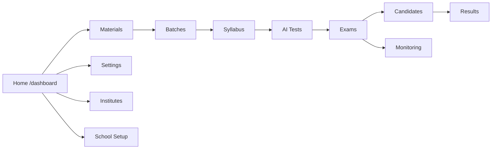

| Module | Route | Process summary |
|--------|-------|-----------------|
| Home | `/dashboard` | KPIs, setup progress, schedule, submissions, violation alerts, quick actions |
| NCERT Books | `/dashboard/materials` | Upload PDFs → indexing (`INDEXING` / `READY` / failed) → feeds syllabus & AI |
| Classes & Batches | `/dashboard/batches` | Classes, batches, enrollment, teacher assignment, topic progress |
| Syllabus | `/dashboard/syllabus` | Chapter/topic tree from indexed books |
| Create Class Test | `/dashboard/ai-tests` | Configure → Generate → Review (completed topics only) |
| Class Tests | `/dashboard/exams` | Draft/schedule/publish, batch assign, security policy |
| Students | `/dashboard/candidates` | CRUD, KYC, bulk ops, class filters |
| Results | `/dashboard/results` | Review, subjective evaluation, publish, ranks, certificates |
| Staff & Teachers | `/dashboard/users` | Users, roles, teacher batch/subject assignment |
| Institute Settings | `/dashboard/settings` | Profile, branding, tenant security preferences |
| Institutes | `/dashboard/institutes` | List/create tenants (`tenant:create`) |
| School Setup | `/dashboard/setup` | Onboarding checklist with deep links |
| Live Monitoring | `/dashboard/monitoring` | Active sessions, violations, intervene |
| Help & Guide | `/dashboard/guide` | In-app admin guide |

**Decision points**

- Publish class test only when **batch enrollment** and **time window** are ready.
- AI generation should use **completed** syllabus topics only.
- KYC verification may be required before high-stakes exams (institute policy).

---

### Teacher Workflow

**Description:** Simplified portal scoped to **assigned batches and subjects** — no Staff/Settings/NCERT upload in main teacher sidebar.

**Navigation:** Home → Syllabus → Topic Progress → Create Class Test → Class Tests → My Students → Results

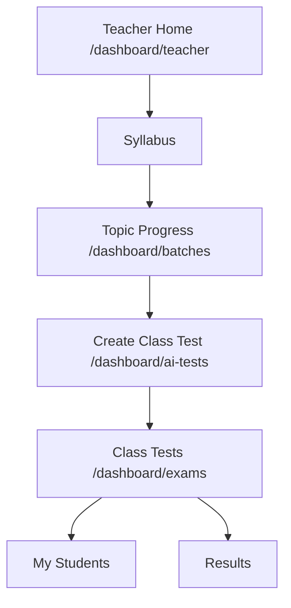

**Daily workflow (textual steps)**

1. Open **Teacher Home** — review assigned batches, upcoming tests, recent submissions.
2. Update **Topic Progress** — mark chapters/topics *In progress* or *Completed* before AI tests.
3. Run **Create Class Test** wizard (same as Super Admin, scoped to assignments) → review questions.
4. **Publish** under **Class Tests** with schedule and security settings.
5. Monitor **My Students** for KYC/readiness; review **Results** per institute policy.

---

### Candidate / Student Workflow

**Description:** Single **Student Portal** at `/my-exams` (no staff dashboard). Three tabs: **Class Tests**, **Results**, **Test syllabus**.

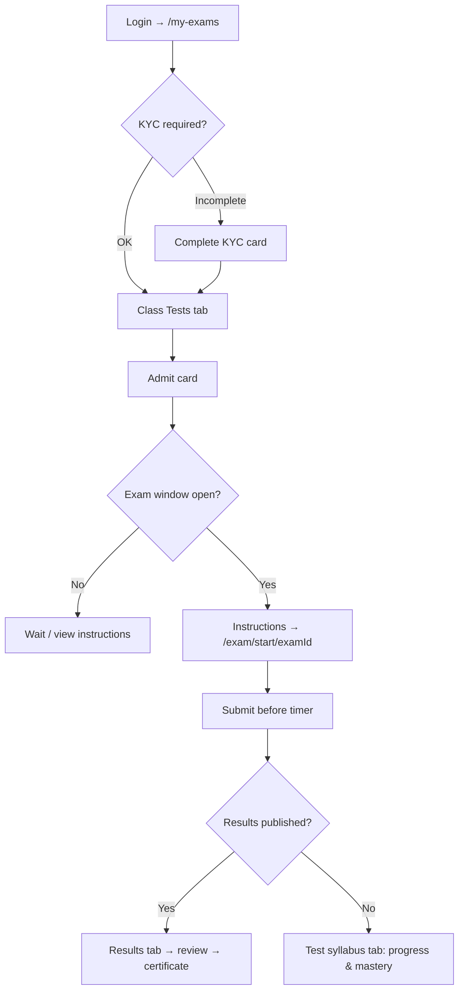

| Tab | Purpose | Key actions |
|-----|---------|-------------|
| Class Tests | Published/completed registered exams | Search, admit card, Start/Resume, readiness checklist |
| Results | Published scores | Rank, pass/fail, answer review, certificate download |
| Test syllabus | Chapter-wise progress & performance | Subject filter, weak-area identification |

---

## Data Flow Diagrams (DFD)

### Context Diagram (Level 0)

**External entities:** Super Admin, Teacher, Student, Proctor, AI Proctoring Service, Email/SMS, Document Storage (S3).

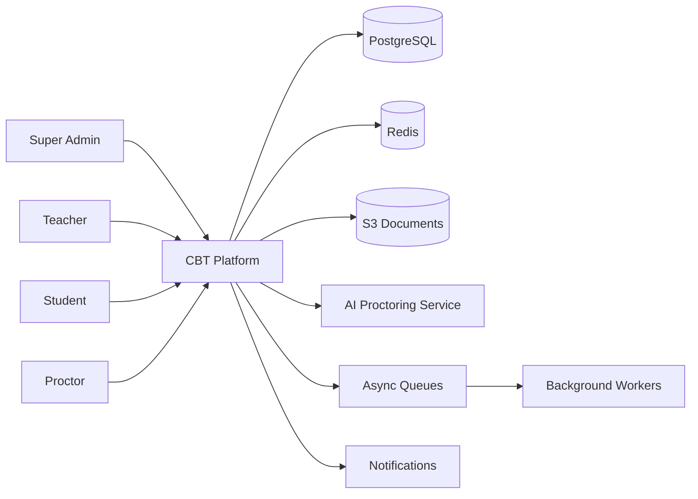

**Description:** All human actors interact through the **Next.js web application** and **REST/WebSocket APIs**. The platform persists tenant-scoped entities in PostgreSQL, caches sessions and hot exam state in Redis, stores uploads and snapshots in S3, forwards proctoring frames to the AI service, and enqueues evaluation/document/notification jobs.

---

### Level 1 — NCERT Material Indexing & Syllabus

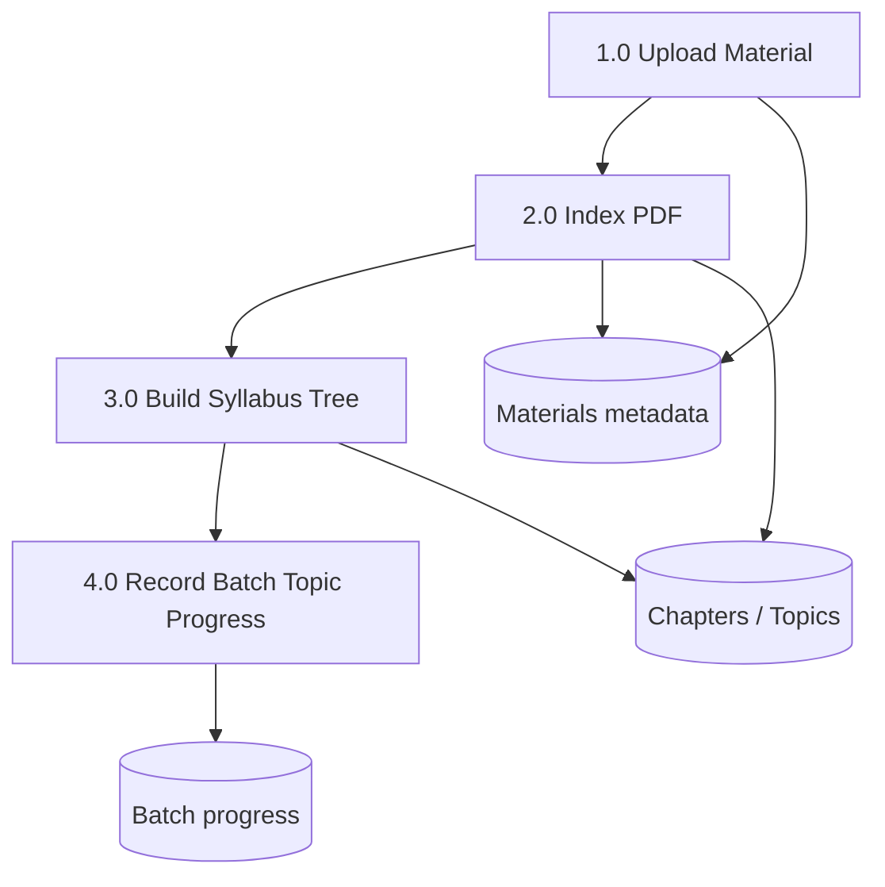

| Process | Input | Transformation | Output |
|---------|-------|----------------|--------|
| 1.0 Upload | PDF, class, subject, session, material type | Validate, store file, create material record | Material row; status `INDEXING` |
| 2.0 Index | PDF binary | Extract chapters/topics for NCERT alignment | Status `READY` or error message |
| 3.0 Build Syllabus | Indexed content | Present filterable chapter/topic tree | Syllabus UI data |
| 4.0 Record Progress | Teacher/Admin updates | Map completion to batch + topic | AI test eligibility (completed topics) |

---

### Level 1 — AI Class Test Generation

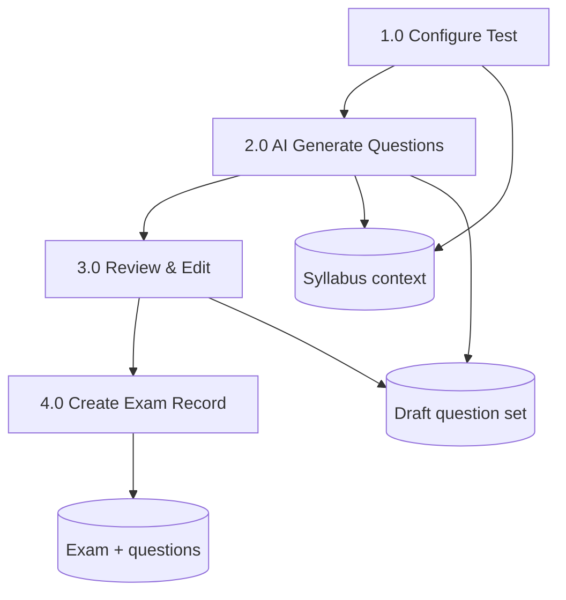

| Step | Decision point | Data transformation |
|------|----------------|---------------------|
| Configure | Only **completed** topics selectable | Batch, subject, difficulty, duration, marks bound to syllabus slice |
| Generate | API/AI service availability | Question objects generated from syllabus context |
| Review | Human approval required | Edit/remove items; approve set |
| Save | Permissions `exam:create` | Persist exam linked to question versions |

---

### Level 1 — Exam Session (Candidate)

Aligns with documented **exam session data flow** and real-time behavior.

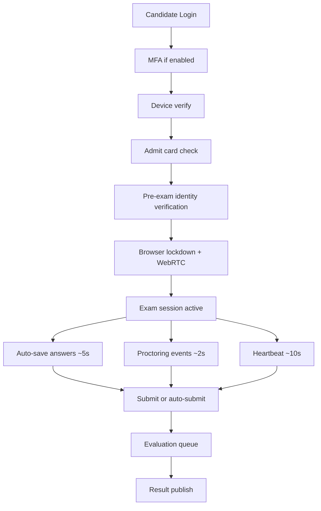

**Parallel channels during session**

- **REST:** Answer persistence, session state, heartbeat.
- **WebSocket:** Real-time saves, proctoring frames, proctor dashboard fan-out.
- **Transformations:** Client answers → `SessionResponse` rows; proctoring metadata → `ProctoringEvent` + risk score on `ExamSession`.

---

## High-Level and Deployment Architecture

### Production Deployment Topology

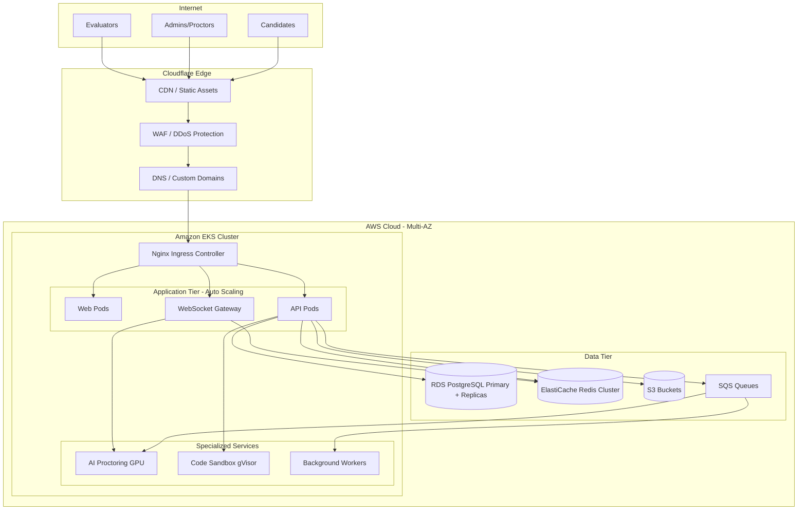

**Primary region:** `ap-south-1`; **DR region:** `ap-southeast-1` (cross-region RDS replica, S3 replication).

### Network Segmentation

- **Public subnet:** ALB, NAT gateway.
- **Private app subnet:** EKS worker nodes (API, web, WebSocket, workers, AI, sandbox).
- **Private data subnet:** RDS PostgreSQL, ElastiCache Redis.
- **Isolated subnet:** Code execution sandbox with **no internet egress**.

### Local Development Stack (Workflow Documentation)

For workflow capture and institute demos:

| Service | Port | Command / location |
|---------|------|-------------------|
| Web | 3002 | `pnpm --filter @cbt/web dev` |
| API | 8000 | `python run_dev.py` in `apps/api-fastapi` |

Reference architecture documents also describe NestJS API on port **4000** and web on **3000** for monorepo `pnpm dev`; client deployments should align environment configuration to the active API implementation in use.

---

## Core Components and Interactions

### Service Catalog

| Service | Type | Responsibility | Scaling trigger |
|---------|------|----------------|-----------------|
| cbt-api | Modular monolith | Core business logic, REST, WebSocket gateway | CPU > 70%, RPS > 5K/pod |
| cbt-web | Frontend | Next.js SSR/CSR, exam client | CPU > 60% |
| cbt-proctoring | Microservice | Face detection, risk scoring, ML inference | GPU utilization > 80% |
| cbt-sandbox | Microservice | Isolated code execution | Queue depth > 100 |
| cbt-worker | Worker | Evaluation, notifications, reports | Queue depth > 500 |
| cbt-pdf | Microservice | Admit cards, scorecards, certificates | Queue depth > 50 |

### Core Monolith Modules (cbt-api)

```text
auth/ tenants/ users/ candidates/ questions/ exams/ exam-engine/
proctoring/ security/ coding/ results/ analytics/ notifications/ audit/ health/
```

**Communication patterns**

- **Synchronous:** NestJS module DI inside monolith.
- **Asynchronous:** Redis Streams / AWS SQS domain events.
- **Real-time:** Socket.IO with Redis adapter for horizontal WebSocket scaling.

### Domain Modules (Functional View)

| Module | Responsibilities |
|--------|------------------|
| Identity & Access | JWT (15 min) + refresh (7 d, rotation), MFA TOTP, device fingerprint, RBAC |
| Tenant Management | Onboarding, white-label, custom domains, per-tenant security policies |
| Candidate Lifecycle | Registration → KYC → Admit card → Exam → Result → Certificate |
| Question Bank | Eight question types, versioning, import/export, topics |
| Exam Engine | Templates, adaptive testing (IRT), section timing, offline IndexedDB sync |
| AI Proctoring | WebRTC → ML service, risk 0–100, violations, proctor intervention |
| Security Enforcement | Lockdown, clipboard block, DevTools/VM/VPN detection, watermarking |
| Coding Assessment | Monaco editor, sandbox execution, plagiarism detection |
| Results & Analytics | Auto/manual evaluation, ranks, cutoffs, dashboards |

### Service Interaction Diagram

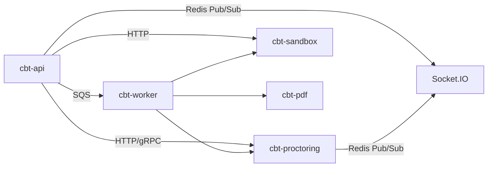

### Background Job Types (cbt-worker)

| Job type | Queue | Priority |
|----------|-------|----------|
| evaluate.exam | evaluation | HIGH |
| generate.admit-card | documents | MEDIUM |
| generate.certificate | documents | MEDIUM |
| send.notification | notifications | MEDIUM |
| aggregate.analytics | analytics | LOW |
| detect.plagiarism | coding | HIGH |
| bulk.import.questions | import | LOW |

---

## Logical and Physical Data Models

### Logical Model — Key Entities

Core tenant-scoped entities include: **Tenant**, **User**, **Role**, **Permission**, **Candidate**, **Question** / **QuestionVersion**, **Exam**, **ExamSection**, **ExamRegistration**, **ExamSession**, **SessionResponse**, **ProctoringEvent**, **SecurityViolation**, **ExamResult**, **AuditLog**, plus **CodingSubmission** where coding assessments apply.

**Relationship summary**

```text
Tenant 1──∞ User 1──∞ UserRole ∞──1 Role ∞──∞ Permission
User 1──1 Candidate 1──∞ ExamRegistration ∞──1 Exam
Exam 1──∞ ExamSection 1──∞ ExamQuestion ∞──1 Question
ExamRegistration 1──∞ ExamSession 1──∞ SessionResponse
ExamSession 1──∞ ProctoringEvent, SecurityViolation
ExamSession 1──1 ExamResult
Question 1──∞ QuestionVersion
```

### Entity Relationship (Core Examination Path)

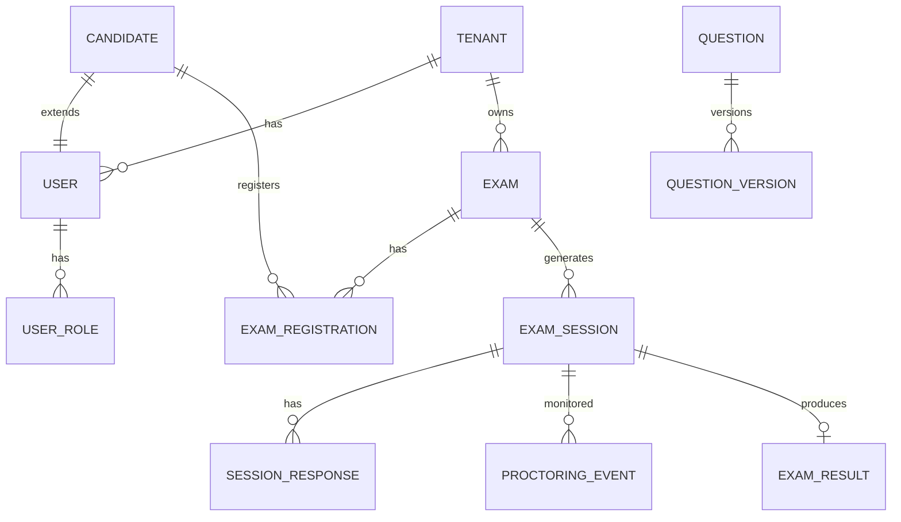

### Physical Model Highlights

| Concern | Approach |
|---------|----------|
| Indexing | B-tree on `(tenant_id, email)`, active sessions, session responses, proctoring time series |
| Full-text search | GIN indexes on questions and audit logs |
| Partitioning | Monthly proctoring events; quarterly audit logs; hash partitioning for session responses by `exam_id` |
| Connection pooling | PgBouncer transaction mode → PostgreSQL; read replicas round-robin |
| ORM | Prisma (`apps/api/prisma/schema.prisma`) |

### Key Enumerations

- **SessionStatus:** `WAITING`, `IDENTITY_VERIFICATION`, `IN_PROGRESS`, `PAUSED`, `SUBMITTED`, `AUTO_SUBMITTED`, `TERMINATED`, `EXPIRED`
- **QuestionType:** MCQ, MSQ, NUMERICAL, SUBJECTIVE, CODING, CASE_STUDY, AUDIO, VIDEO
- **EvaluationStatus:** PENDING → AUTO_EVALUATED / MANUAL_REVIEW → EVALUATED → PUBLISHED

### Backup and Recovery (Physical)

| Component | Method | RPO / RTO alignment |
|-----------|--------|---------------------|
| PostgreSQL | RDS snapshots + WAL PITR | RPO < 1 min; RTO < 15 min (Multi-AZ failover) |
| Redis | RDB + AOF | Session/cache recovery |
| S3 | Versioning + cross-region replication | Document durability |
| Kubernetes | Velero daily | Application state backup |

---

## API Specifications

### Base URLs and Headers

```http
Production:  https://api.{tenant-domain}/v1
Development: http://localhost:4000/api/v1
WebSocket:   wss://api.{tenant-domain}/ws

Authorization: Bearer <access_token>
X-Tenant-ID: <tenant_slug>
X-Device-Fingerprint: <fingerprint_hash>
X-Request-ID: <uuid>
```

### Authentication (`/auth`)

| Method | Endpoint | Description |
|--------|----------|-------------|
| POST | `/auth/login` | Email/password login |
| POST | `/auth/mfa/verify` | TOTP verification |
| POST | `/auth/refresh` | Refresh token rotation |
| POST | `/auth/logout` | Session invalidation |
| GET | `/auth/sessions` | List active sessions |

**Login response (conceptual):** `accessToken`, `refreshToken`, `expiresIn`, user profile with `roles[]`, optional `mfaRequired`.

### Tenants (`/tenants`) — Platform & Institute Config

| Method | Endpoint | Permission |
|--------|----------|------------|
| POST | `/tenants` | `tenant:create` |
| GET | `/tenants` | `tenant:read` |
| PATCH | `/tenants/:id/branding` | `tenant:branding` |
| PATCH | `/tenants/:id/security` | `tenant:security_config` |

### Candidates (`/candidates`)

Supports institute **Students** workflow: CRUD, KYC submit/verify, bulk import, admit card generation, candidate dashboard (`/candidates/me/dashboard`).

### Exams and Exam Engine

| Area | Key endpoints | Maps to UI |
|------|---------------|------------|
| Exams | `POST /exams`, `POST /exams/:id/publish`, assign candidates | Class Tests |
| Sessions | `POST /exam-sessions/start`, `POST .../responses`, `POST .../submit`, heartbeat | Exam client `/exam/start/[examId]` |
| Proctoring | `POST /proctoring/verify-identity`, `GET .../live`, intervene/terminate | Live Monitoring |
| Results | `POST /results/publish/:examId`, scorecard/certificate | Results modules & student tab |

### Standard Response Envelope

```typescript
interface ApiResponse<T> {
  success: boolean;
  data: T;
  meta?: { page: number; limit: number; total: number; totalPages: number };
  timestamp: string;
  requestId: string;
}
```

### AI Proctoring Microservice Contract (Excerpt)

```json
POST /analyze/frame
{
  "sessionId": "uuid",
  "candidateId": "uuid",
  "frameBase64": "...",
  "timestamp": "ISO8601",
  "metadata": { "tabVisible": true, "fullscreen": true }
}
```

Response includes `riskScore`, `violations[]`, `faceMatch`, and `eyeTracking` fields for orchestration by cbt-api.

### API Versioning and Pagination

- URL versioning: `/api/v1/...`
- Deprecation via `Sunset` header; minimum six-month deprecation window
- Pagination: `?page=1&limit=20&sort=createdAt:desc&filter[...]=...`

---

## Real-Time Architecture (WebSocket)

### Namespaces

| Namespace | Purpose | Participants |
|-----------|---------|--------------|
| `/exam` | Session sync, timers, submit | Candidate |
| `/proctoring` | Frames, violations, identity | Candidate, Proctor |
| `/monitoring` | Live dashboard | Proctor, Exam Manager |
| `/notifications` | System notifications | Authenticated users |

### Exam Session Timing (Documented Intervals)

| Activity | Interval |
|----------|----------|
| Answer auto-save | ~5 seconds (REST and/or `exam:save-answer`) |
| Proctoring metadata | ~2 seconds |
| Heartbeat | ~10 seconds |

### Representative Events

- **Client → server:** `exam:join`, `exam:heartbeat`, `exam:save-answer`, `exam:submit`, `proctoring:frame`, `proctoring:browser-event`
- **Server → client:** `exam:time-warning`, `exam:time-up`, `exam:paused`, `exam:terminated`, `proctoring:violation`, `proctoring:risk-update`

---

## Security Architecture

### Defense-in-Depth Layers

1. **Perimeter:** Cloudflare WAF, DDoS, bot management  
2. **Transport:** TLS 1.3, HSTS, certificate pinning (exam client)  
3. **Application:** JWT, RBAC guards, input validation, CSRF protections  
4. **Data:** AES-256-GCM for sensitive fields, row-level security where applicable  
5. **Exam:** Browser lockdown, proctoring, dynamic watermark  
6. **Monitoring:** Immutable audit logs, SIEM integration, anomaly detection  

### Exam Security Policy (Configurable per Exam)

```typescript
interface ExamSecurityPolicy {
  fullscreen: boolean;
  blockCopyPaste: boolean;
  blockRightClick: boolean;
  blockPrint: boolean;
  detectDevTools: boolean;
  detectScreenCapture: boolean;
  detectVirtualMachine: boolean;
  detectMultipleMonitors: boolean;
  watermark: { enabled: boolean; content: 'candidateId' | 'email' | 'custom'; opacity: number };
  allowedBrowsers: ('chrome' | 'firefox' | 'edge')[];
  sebConfigKey?: string;
}
```

### Violation Handling (Examples)

| Violation | Severity | Auto-response |
|-----------|----------|---------------|
| Tab switch | MEDIUM | Warning + log |
| Copy attempt | HIGH | Warning + log |
| DevTools | HIGH | Alert proctor |
| Multiple faces | CRITICAL | Alert + flag |
| Screen share | CRITICAL | Terminate session |

### Rate Limiting (Tiered)

| Category | Limit |
|----------|-------|
| auth | 10 requests / minute |
| api | 100 requests / minute |
| exam saves | 30 requests / minute |
| proctoring frames | 60 requests / minute |
| upload | 10 requests / 5 minutes |

### Audit Logging

Security-relevant actions append to **immutable** audit storage (partitioned PostgreSQL + S3 archival). Fields include tenant, user, action, resource type/id, IP, user agent, device fingerprint, optional geo, severity.

### Compliance Orientation

Documentation includes GDPR, ISO 27001, and SOC 2 readiness checklists (DPA, erasure workflows, consent for biometric proctoring, exam-day BCP, change management via CI/CD).

---

## AI Proctoring Architecture

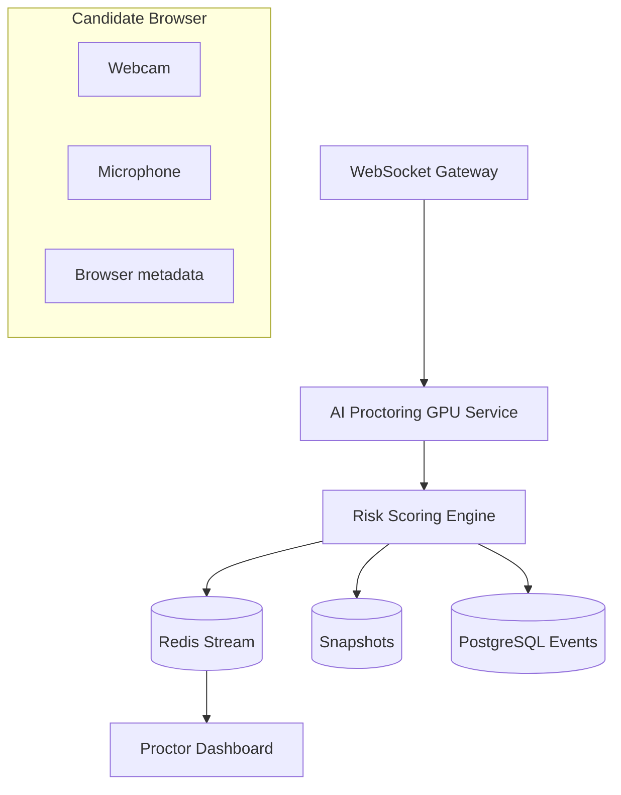

### Risk Score Composition

| Component | Weight |
|-----------|--------|
| Face presence | 20% |
| Face match | 25% |
| Multiple faces | 20% |
| Eye tracking | 15% |
| Head pose | 10% |
| Audio anomaly | 5% |
| Phone detection | 5% |

### Threshold Actions

| Score | Level | Action |
|-------|-------|--------|
| 0–30 | LOW | Normal monitoring |
| 31–50 | MEDIUM | Log; increase snapshot frequency |
| 51–70 | HIGH | Alert proctor; warn candidate |
| 71–85 | CRITICAL | Proctor intervention required |
| 86–100 | SEVERE | Auto-flag; optional auto-terminate |

---

## Deployment Architecture (Kubernetes Summary)

### Namespace Layout

- `cbt-production`, `cbt-staging`, `cbt-monitoring`, `cbt-logging`, `ingress-nginx`, `cert-manager`

### Replica Bounds (Documented)

| Deployment | Min | Max | Notes |
|------------|-----|-----|-------|
| cbt-api | 3 | 100 | 1 CPU, 2 Gi |
| cbt-web | 2 | 50 | 0.5 CPU, 1 Gi |
| cbt-proctoring | 2 | 30 | GPU nodes |
| cbt-sandbox | 2 | 20 | Isolated network |
| cbt-worker | 2 | 30 | Queue-driven |

**Rollout strategy:** RollingUpdate with `maxUnavailable: 0` for API; HPA on CPU/memory/custom metrics (RPS, queue depth).

### Repository Layout (Monorepo)

```text
cbt-platform/
├── apps/api/          # NestJS backend (REST + WebSocket)
├── apps/web/          # Next.js frontend
├── packages/shared/   # Shared types, constants, RBAC
├── infra/docker/      # Docker Compose (dev)
├── infra/k8s/         # Kubernetes manifests (prod)
└── docs/              # Architecture & workflow documents
```

---

## Domain Event Bus (Integration)

```typescript
interface DomainEvent {
  id: string;
  type: string;
  tenantId: string;
  aggregateId: string;
  aggregateType: string;
  payload: Record<string, unknown>;
  metadata: {
    userId?: string;
    correlationId: string;
    timestamp: string;
    version: number;
  };
}
```

**Representative event types:** `exam.session.started`, `exam.session.submitted`, `proctoring.violation.detected`, `proctoring.risk.threshold.exceeded`, `candidate.registered`, `result.published`, `audit.security.violation`.

---

## UI Route Map (Workflow to Application)

| Persona | Primary routes |
|-----------|----------------|
| Super Admin | `/dashboard`, `/dashboard/materials`, `/dashboard/batches`, `/dashboard/syllabus`, `/dashboard/ai-tests`, `/dashboard/exams`, `/dashboard/candidates`, `/dashboard/results`, `/dashboard/users`, `/dashboard/settings`, `/dashboard/institutes`, `/dashboard/setup`, `/dashboard/monitoring`, `/dashboard/guide` |
| Teacher | `/dashboard/teacher`, shared syllabus/ai-tests/exams/candidates/results routes (scoped) |
| Student | `/my-exams`, `/exam/start/[examId]` |

---

## Related Documentation Index

| Document | Topic |
|----------|--------|
| [USER-WORKFLOW-GUIDE.md](./USER-WORKFLOW-GUIDE.md) | Role workflows with UI detail |
| [01-system-architecture.md](./01-system-architecture.md) | System design principles |
| [02-high-level-architecture.md](./02-high-level-architecture.md) | Topology and request flows |
| [03-microservices-breakdown.md](./03-microservices-breakdown.md) | Services and events |
| [04-database-schema.md](./04-database-schema.md) | ER diagram, indexing, partitioning |
| [05-prisma-models.md](./05-prisma-models.md) | ORM models and enums |
| [06-api-structure.md](./06-api-structure.md) | REST endpoints |
| [08-rbac-permissions.md](./08-rbac-permissions.md) | Permission matrix |
| [09-security-architecture.md](./09-security-architecture.md) | Security controls |
| [10-ai-proctoring-architecture.md](./10-ai-proctoring-architecture.md) | ML pipeline |
| [11-websocket-events.md](./11-websocket-events.md) | WebSocket catalog |
| [13-deployment-architecture.md](./13-deployment-architecture.md) | AWS/EKS deployment |

---

## Document Revision

| Field | Value |
|-------|--------|
| Platform scope | NCERT institute CBT (Classes 9–12) |
| Workflow source | User Workflow Guide |
| Architecture source | Docs 01–13 series |
| Format | Hierarchical markdown; Mermaid for diagrams |

*End of document.*
