# CBT Platform — User Workflow Guide (with Screenshots)

## CBT

**Computer-Based Test (CBT) Platform** — an NCERT-aligned institute system for Classes 9–12. Upload textbooks, organize **classes and batches**, track **syllabus progress**, generate **AI class tests**, assign **students**, run **proctored exams**, and publish **results** and certificates.

**Login URL (local dev):** `http://localhost:3002/login`

---

## Total users (role types)

The product is built around three primary user types:

| # | Role | Portal | Demo account (seed data) |
|---|------|--------|---------------------------|
| 1 | **Super Admin** | Full dashboard (`/dashboard`) | `admin@cbt-platform.com` / `Admin@123` |
| 2 | **Teacher** | Teacher portal (`/dashboard/teacher`) | `teacher@example.com` / `Teacher@123` |
| 3 | **Candidate / Student** | Student portal (`/my-exams`) | `candidate@example.com` / `Candidate@123` |

> **Note:** Counts of students, staff, and institutes grow per tenant. The table above is **role types**, not a fixed user count.

---

## Workflows

---

# 1. Super Admin

## Description

Super Admin has **all permissions** on the platform: create **institutes (tenants)**, run the full NCERT workflow (books → batches → syllabus → tests → students → results), manage **staff and teachers**, configure the institute, monitor **live exam sessions**, and review **audit** data. After login, Super Admin lands on **Home** (`/dashboard`).

**Sidebar (main navigation):** Home → NCERT Books → Classes & Batches → Syllabus → Create Class Test → Class Tests → Students → Results  

**Configuration:** Staff & Teachers, Institute Settings  

**Platform-only:** Institutes (`/dashboard/institutes`)

---

## 1. Home (Dashboard)

**Route:** `/dashboard`

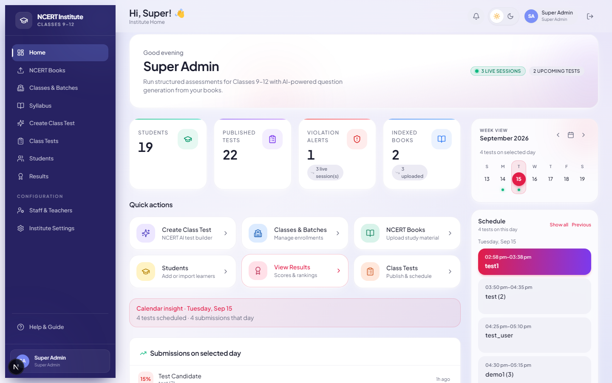

### What it does

Central command view for institute operations: setup progress, KPIs, schedule, submissions, and proctoring alerts.

### Main elements

| Area | Elements / features |
|------|---------------------|
| **Greeting header** | Time-based greeting, user name, role subtitle |
| **Live status badges** | Active exam sessions; count of upcoming tests |
| **Setup banner** (until 100%) | Progress bar, next onboarding step, links to **Continue setup** / **Full onboarding** |
| **Stat cards** | Students, published tests, violation alerts, total exams (permission-based) |
| **Quick actions** | Shortcuts: Create Class Test, Classes & Batches, NCERT Books, Students, Results, Class Tests |
| **Week / schedule strip** | Calendar week view, filter by date, upcoming vs previous tests |
| **Recent submissions** | Latest student submits with score and time |
| **Violation alerts** | Proctoring events with severity; open detail, clear or restore |
| **School setup checklist** | Links to each onboarding step when setup is incomplete |

### Typical workflow

1. Check setup progress and violation alerts.  
2. Use quick actions to jump to the next task (upload books, add students, publish a test).  
3. Open **Live Monitoring** when sessions are active.

---

## 2. NCERT Books

**Route:** `/dashboard/materials`

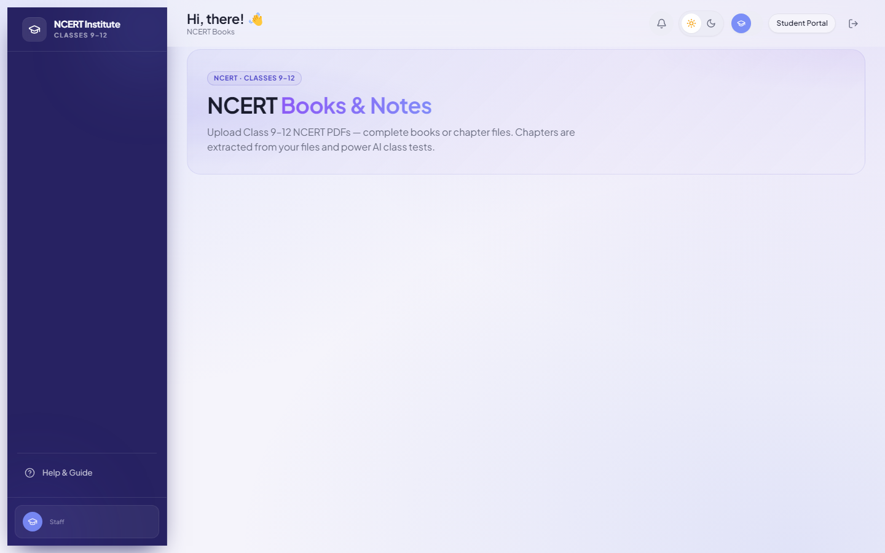

### What it does

Upload PDF textbooks and notes; files are **indexed** into chapters/topics for syllabus and AI test generation.

### Main elements

| Element | Feature |
|---------|---------|
| **Upload panel** | Class, subject, session, file picker, material type |
| **Materials list** | Title, class, subject, status (Indexing / Indexed / Failed) |
| **Actions** | Preview, download, re-index, delete (permission-based) |
| **Status badges** | `READY` (indexed), `INDEXING`, errors with message |

### Workflow

Upload core NCERT PDFs first → wait for **Indexed** → open **Syllabus** to verify chapters.

---

## 3. Classes & Batches

**Route:** `/dashboard/batches`

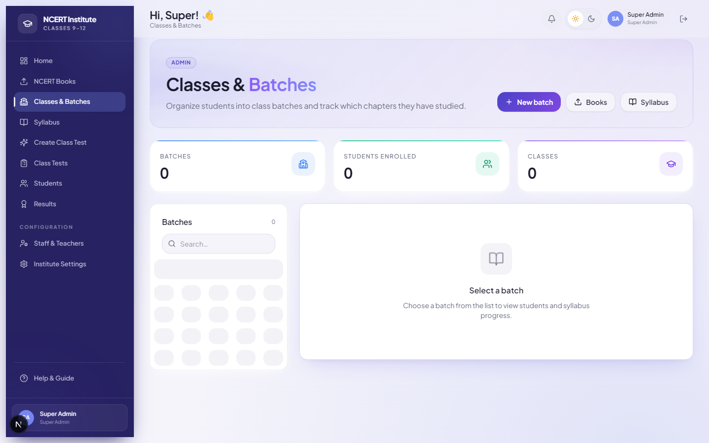

### What it does

Define **academic classes** (e.g. Class 10) and **batches** (sections/years); enroll students; assign teachers to subjects; track **syllabus progress** per batch.

### Main elements

| Element | Feature |
|---------|---------|
| **Class tabs** | Switch between academic classes |
| **Batch cards / list** | Batch name, academic year, enrollment count |
| **Enroll students** | Roll numbers, add/remove enrollments |
| **Teacher assignments** | Link teachers to batch + subject |
| **Syllabus progress** | Mark chapters/topics completed or in progress |
| **Notifications** | New student registration can highlight a class tab |

### Workflow

Create class → create batch → enroll students → assign teachers → update topic progress before AI tests.

---

## 4. Syllabus

**Route:** `/dashboard/syllabus`

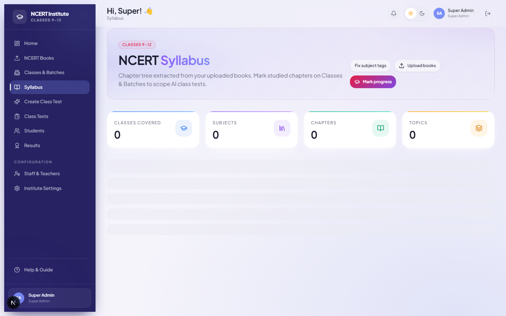

### What it does

Browse **chapters and topics** extracted from uploaded books; align curriculum structure across subjects.

### Main elements

| Element | Feature |
|---------|---------|
| **Class / subject selectors** | Filter syllabus tree |
| **Chapter list** | Chapter number, title, topics |
| **Book linkage** | Content sourced from indexed materials |
| **Navigation** | Jump to related batch progress or tests |

### Workflow

Confirm chapters match your teaching plan after books are indexed.

---

## 5. Create Class Test

**Route:** `/dashboard/ai-tests`

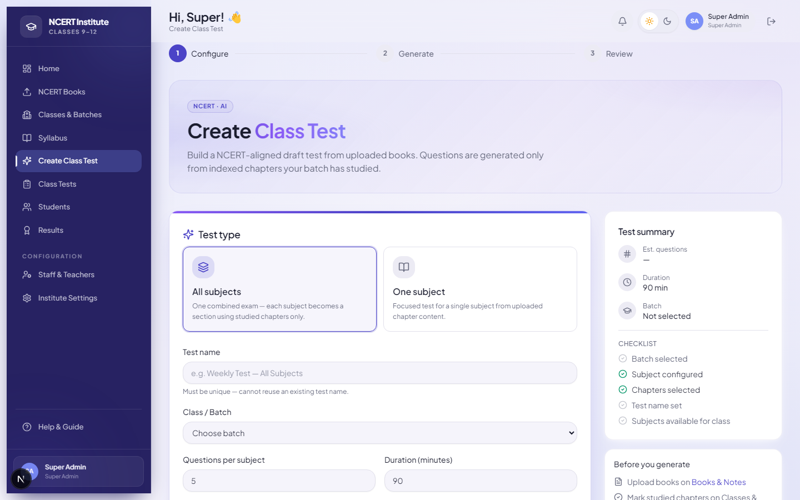

### What it does

**AI-powered** NCERT class test builder: pick batch, subject, chapters/topics, difficulty, and question count; generate → review → save/publish pipeline.

### Main elements

| Step | Features |
|------|----------|
| **1. Configure** | Batch, subject, chapters (studied/completed), difficulty, duration, marks |
| **2. Generate** | AI question generation from syllabus context |
| **3. Review** | Edit/remove questions, approve set before exam record is created |
| **Modes** | Single-chapter vs multi-chapter / full test options |

### Workflow

Select only **completed** syllabus topics → generate → review questions → proceed to **Class Tests** to schedule and publish.

---

## 6. Class Tests

**Route:** `/dashboard/exams`

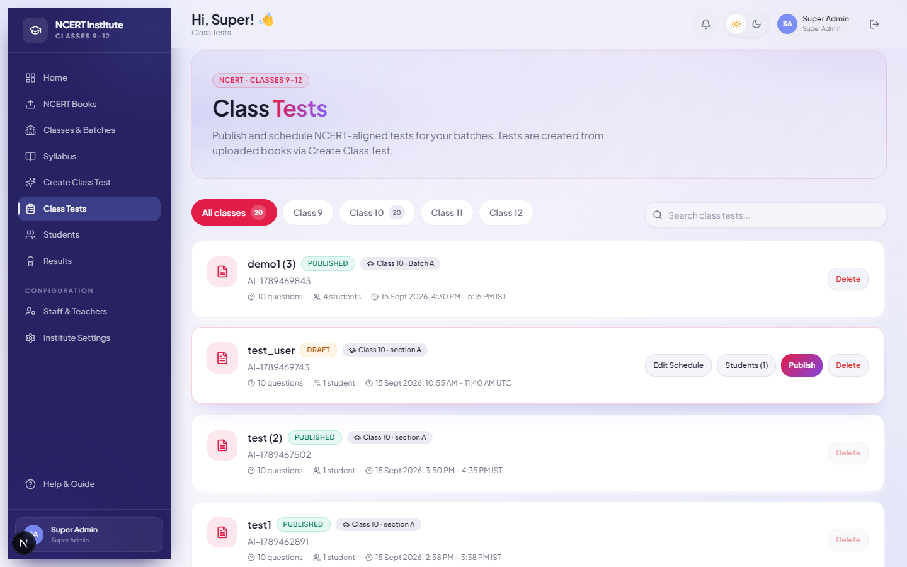

### What it does

Manage the **exam lifecycle**: draft, schedule, publish, assign batches/candidates, security settings, monitoring links.

### Main elements

| Element | Feature |
|---------|---------|
| **Exam list** | Code, title, status, window, registrations |
| **Filters / search** | Find tests by status or name |
| **Publish / schedule** | Start/end time, timezone, duration |
| **Assign batch** | Register all students in a batch |
| **Security policy** | Proctoring, fullscreen, tab switch rules |
| **Actions** | Edit, duplicate, view responses (permission-based) |

### Workflow

Publish only when batch enrollment and time window are ready → students see tests on **Student Portal**.

---

## 7. Students

**Route:** `/dashboard/candidates`

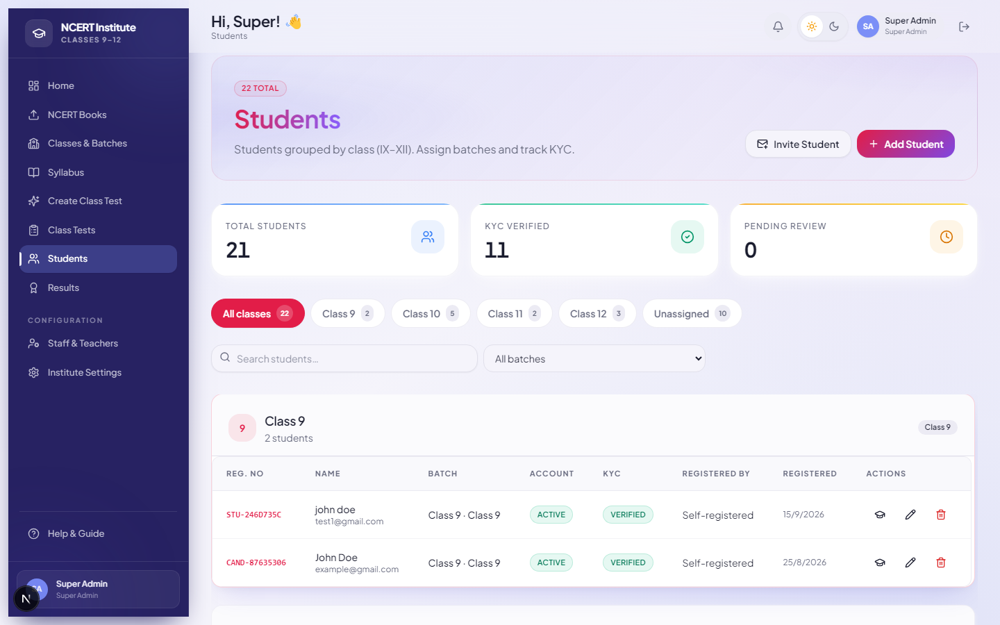

### What it does

**Candidate management**: create student accounts, KYC, class filters, bulk operations, registration invites.

### Main elements

| Element | Feature |
|---------|---------|
| **Stats header** | Totals by class / KYC state |
| **Class tabs** | Filter students; highlight on new registration |
| **Student table** | Name, email, roll, batch, KYC status |
| **Actions** | Create, edit, verify/reject KYC, deactivate |
| **Search & pagination** | Find students quickly |

### Workflow

Add students → assign to batch on **Classes & Batches** → ensure KYC verified if institute requires it before exams.

---

## 8. Results

**Route:** `/dashboard/results`

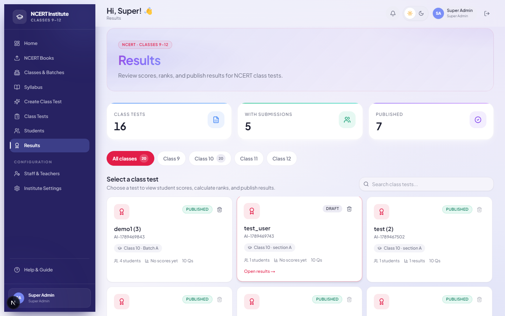

### What it does

Review attempts, **evaluate** subjective items, **publish** results, ranks, cutoffs, certificates.

### Main elements

| Element | Feature |
|---------|---------|
| **Exam / batch filters** | Scope results view |
| **Score table** | Percentage, rank, pass/fail |
| **Publish controls** | Release results to student portal |
| **Answer review** | Inspect responses per question |
| **Export / certificate** | Where enabled by policy |

### Workflow

After submissions close → evaluate if needed → **publish** → students see **Results** tab on portal.

---

## 9. Staff & Teachers

**Route:** `/dashboard/users`

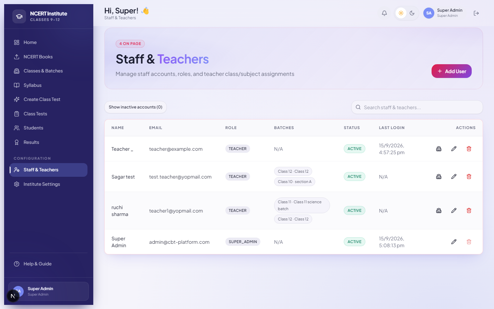

### What it does

Manage staff accounts; assign **Super Admin** or **Teacher** roles; assign teachers to **classes/batches**.

### Main elements

| Element | Feature |
|---------|---------|
| **User table** | Name, email, role, status, last login |
| **Create user** | Dialog with role selection |
| **Assign classes** | For teachers — batch/subject assignment |
| **Inactive users** | Toggle show inactive; purge workflows (admin) |

### Workflow

Create teacher → assign batches/subjects → teacher uses **Teacher portal** for daily teaching.

---

## 10. Institute Settings

**Route:** `/dashboard/settings`

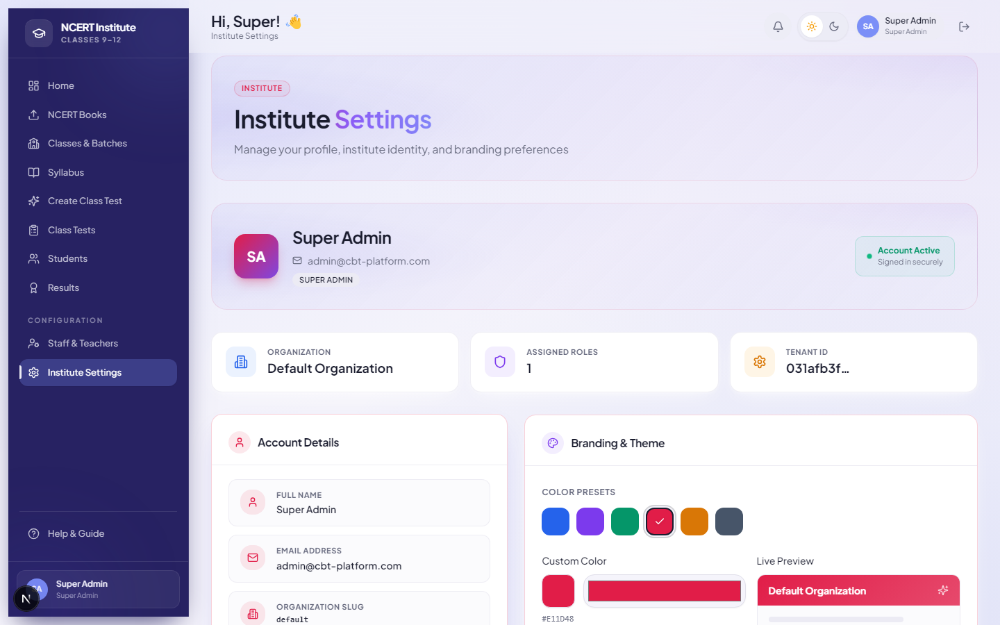

### What it does

Tenant profile, branding, security preferences, and institute-level configuration.

### Main elements

| Element | Feature |
|---------|---------|
| **Institute profile** | Name, slug, contact |
| **Branding** | Logo/colors where configured |
| **Security options** | Exam and access policies (tenant-scoped) |

---

## 11. Institutes (platform)

**Route:** `/dashboard/institutes`  
*(Super Admin — `tenant:create`)*

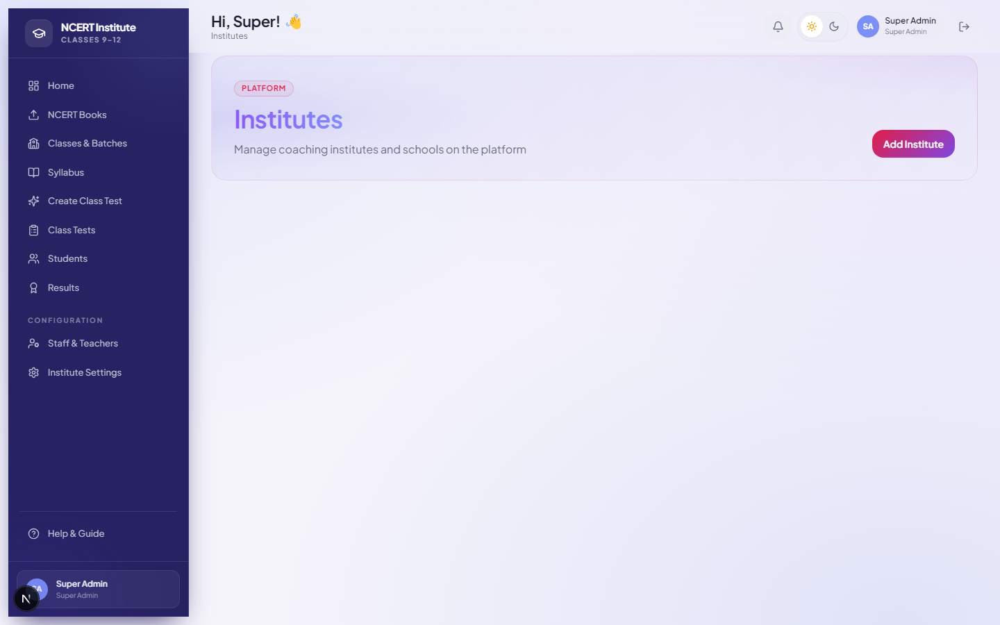

### What it does

**Multi-tenant platform admin**: list and create schools/coaching institutes.

### Main elements

| Element | Feature |
|---------|---------|
| **Institute list** | Name, slug, active state |
| **Add Institute** | Create new tenant with name + slug |

---

## 12. School Setup (onboarding)

**Route:** `/dashboard/setup`

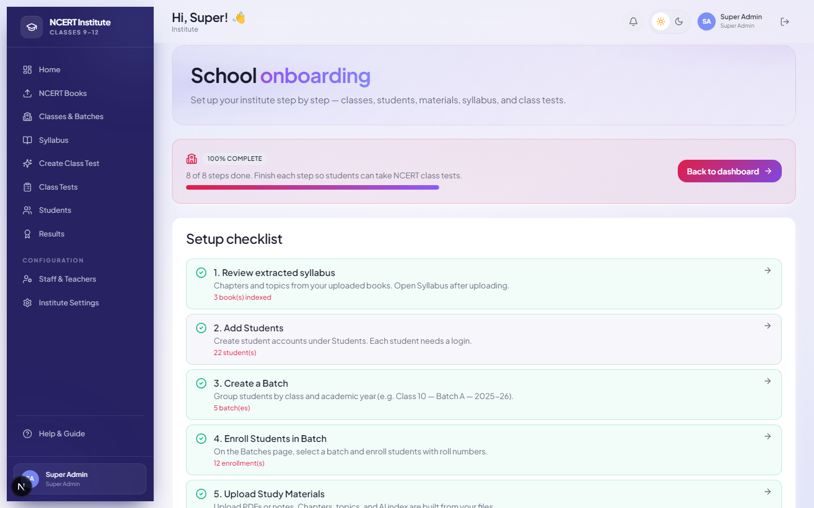

### What it does

Step-by-step **onboarding checklist** with progress % and deep links (syllabus, students, batches, materials, AI tests).

### Workflow

Follow numbered steps until all are marked done; mirrors the recommended institute go-live order.

---

## 13. Live Monitoring

**Route:** `/dashboard/monitoring`

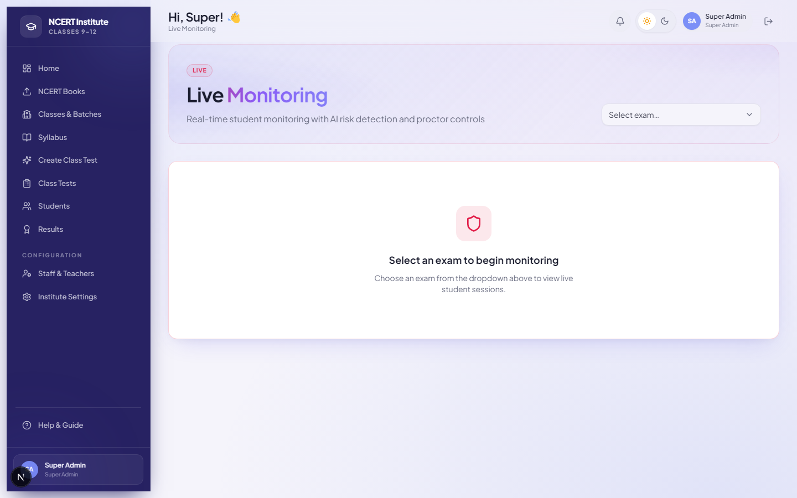

### What it does

**Proctor dashboard**: watch active sessions, violations, and intervene during live class tests.

### Main elements

| Element | Feature |
|---------|---------|
| **Active sessions** | Candidate, exam, risk indicators |
| **Violation stream** | Real-time proctoring events |
| **Intervention tools** | Warn, pause, or terminate (permission-based) |

---

## 14. Help & Guide

**Route:** `/dashboard/guide`

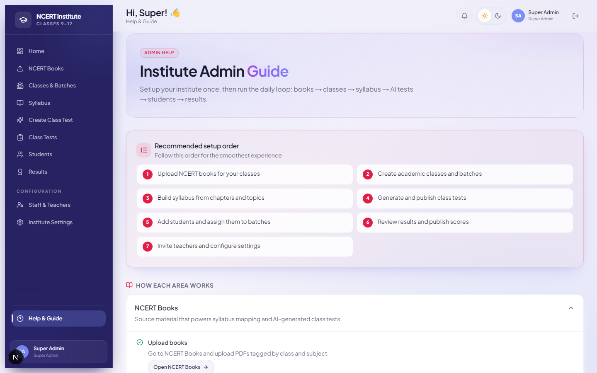

### What it does

In-app **Institute Admin guide**: recommended setup order, FAQs, and links to each module.

---

# 2. Teacher

## Description

Teachers use a **simplified portal** (no Staff/Settings/NCERT upload in the main sidebar). They work on **assigned batches and subjects**: syllabus, **topic progress**, **AI class tests**, publishing exams, **my students**, and **results**. Login redirects to **`/dashboard/teacher`**.

**Sidebar:** Home → Syllabus → Topic Progress → Create Class Test → Class Tests → My Students → Results

---

## 1. Home (Teacher Dashboard)

**Route:** `/dashboard/teacher`

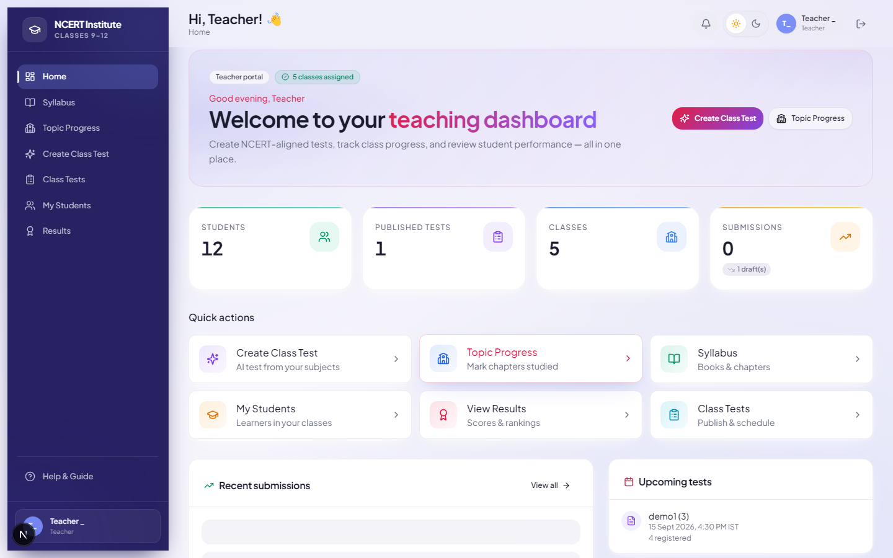

### What it does

Teaching hub: assigned batches, upcoming tests, recent submissions, and quick actions.

### Main elements

| Element | Feature |
|---------|---------|
| **Welcome / stats** | Batches, students, tests, submissions |
| **Assigned batches** | Class name, subject, enrollment count |
| **Upcoming tests** | Schedule for your classes |
| **Recent results** | Latest scores for your students |
| **Quick actions** | Create Class Test, Topic Progress, Syllabus, My Students, Results |

### Workflow

Start here each day → update **Topic Progress** → create/publish tests → check **Results**.

---

## 2. Syllabus

**Route:** `/dashboard/syllabus`

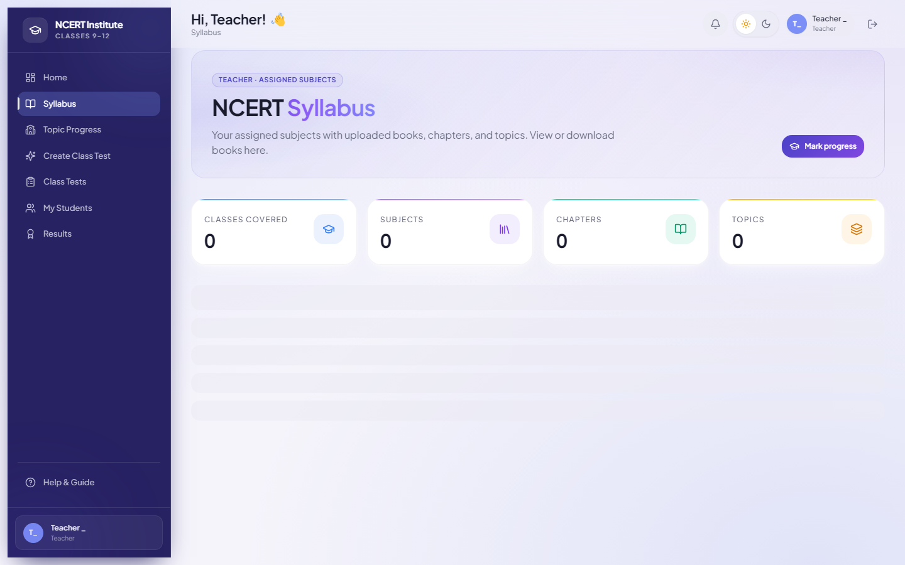

### What it does

View **books, chapters, and topics** for subjects you teach (NCERT content lives here for teachers).

### Workflow

Confirm what is taught vs planned before generating AI tests.

---

## 3. Topic Progress

**Route:** `/dashboard/batches` *(labeled “Topic Progress” in teacher nav)*

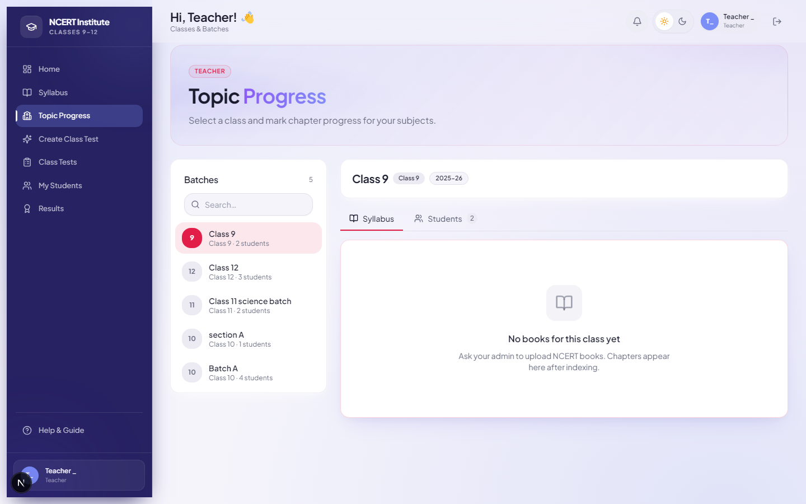

### What it does

Mark chapters/topics **In progress** or **Completed** for your batches so AI tests use the right content.

### Workflow

Update progress **before** **Create Class Test** → only completed chapters should drive generation.

---

## 4. Create Class Test

**Route:** `/dashboard/ai-tests`

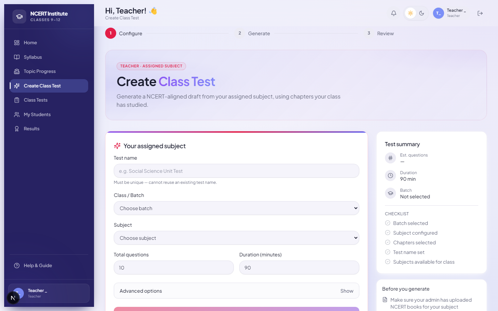

Same wizard as Super Admin, scoped to **teacher assignments** (batch/subject).

### Workflow

Configure → Generate → Review → save exam → publish under **Class Tests**.

---

## 5. Class Tests

**Route:** `/dashboard/exams`

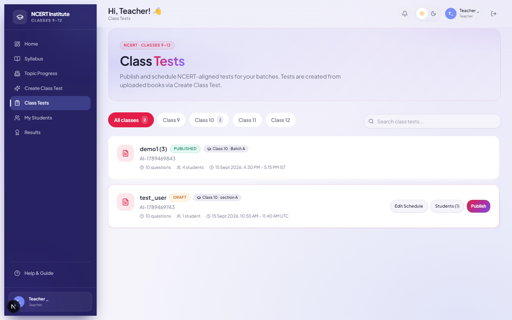

Schedule, publish, and manage tests for assigned classes.

---

## 6. My Students

**Route:** `/dashboard/candidates`

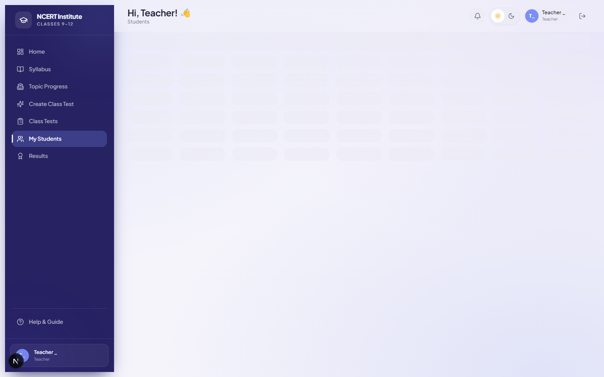

View learners in your batches; check KYC/readiness before high-stakes tests.

---

## 7. Results

**Route:** `/dashboard/results`

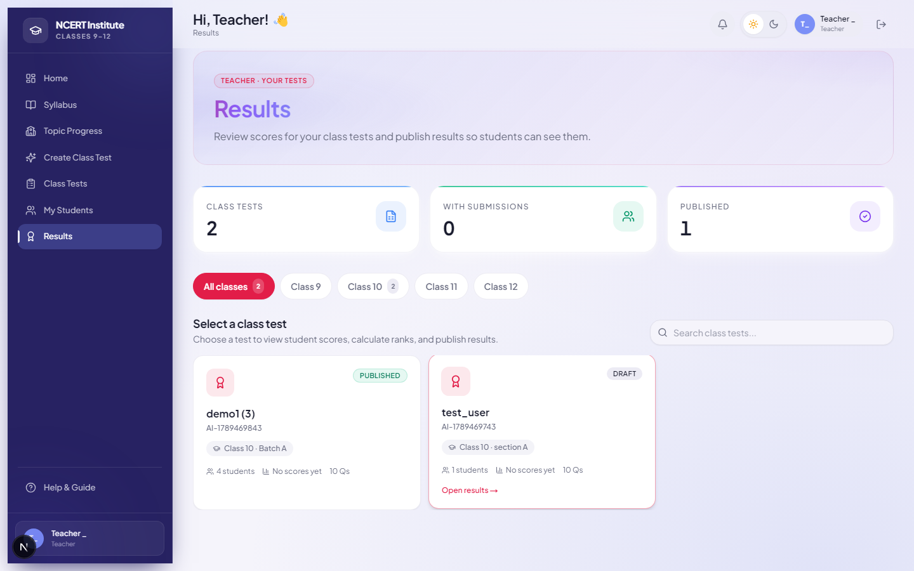

Review and evaluate/publish scores for your class tests (per institute policy).

---

## 8. Help & Guide

**Route:** `/dashboard/guide`

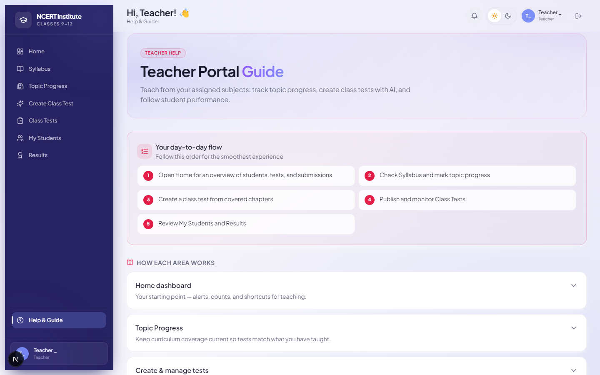

Teacher-specific guide and FAQs (no access to Staff & Settings — expected).

---

# 3. Candidate / Student

## Description

Students and exam **candidates** use the **Student Portal** only (`/my-exams`). They do not see the staff dashboard. They take **NCERT class tests**, complete **KYC** when required, view **results**, and track **test syllabus / progress**.

**Login redirect:** `/my-exams`

---

## Student Portal overview

The portal has **one main page** with **three tabs**:

1. **Class Tests**  
2. **Results**  
3. **Test syllabus** (syllabus progress / mastery)

Plus: profile card, KYC card, stats row, exam-day readiness tips, admit card, and certificate download.

---

## 1. Class Tests tab

**Route:** `/my-exams` (default tab)

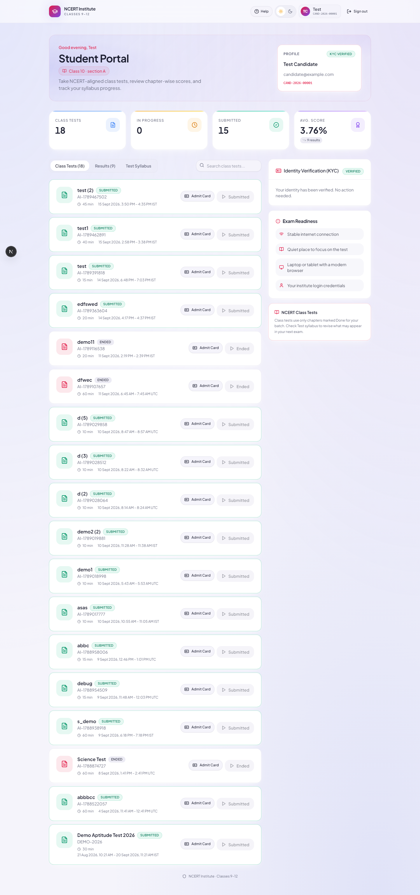

### What it does

Lists **published** (and completed) exams the student is registered for.

### Main elements

| Element | Feature |
|---------|---------|
| **Hero** | Greeting, batch badge (class · section) |
| **Profile card** | Name, email, registration number, **KYC status** |
| **Stat cards** | Class tests count, in progress, submitted, average score |
| **Tab bar** | Class Tests / Results / Test syllabus |
| **Search** | Filter tests by title/code |
| **Exam cards** | Status badge (upcoming, live, submitted), schedule, duration |
| **Actions** | **Admit card**, **Start** / **Resume**, view instructions |
| **KYC submit card** | Upload/complete KYC when required |
| **Readiness checklist** | Internet, quiet place, device, credentials |

### Workflow

1. Complete KYC if blocked.  
2. Open **Admit card** before window opens.  
3. When status is **Available**, go to **Instructions** → **Start exam** (`/exam/start/[examId]`).  
4. Submit before timer ends; proctoring may run in the exam UI.

---

## 2. Results tab

**Route:** `/my-exams` → **Results** tab

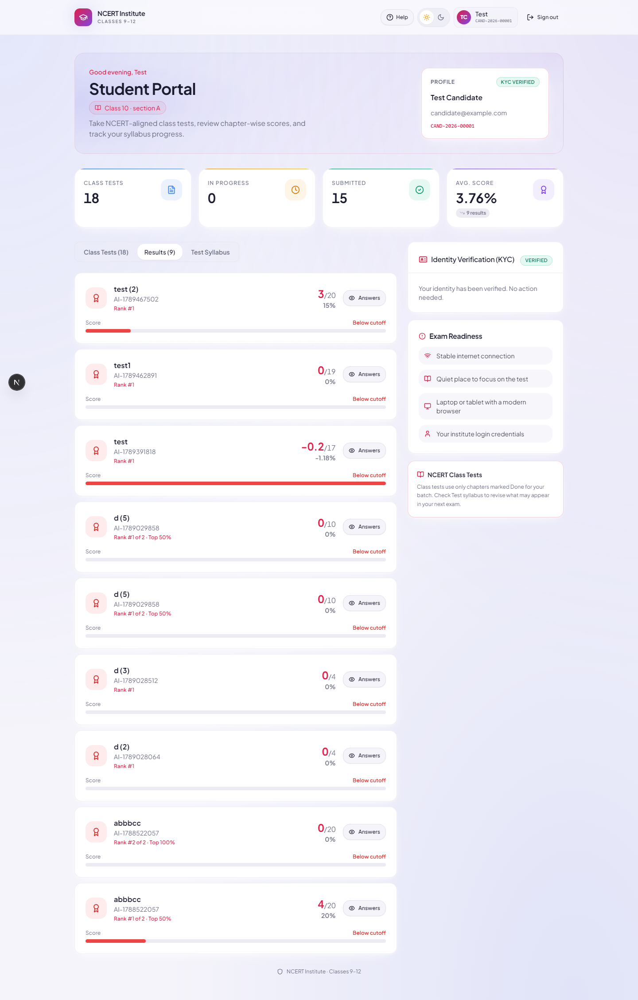

### What it does

Shows **published** scores: percentage, rank (if enabled), pass/fail, answer review, certificates.

### Main elements

| Element | Feature |
|---------|---------|
| **Result cards** | Exam title, score, rank, submitted time |
| **Review answers** | Dialog per result (when allowed) |
| **Certificate** | Download/print when published |
| **Empty state** | Message when no results yet |

### Workflow

After institute **publishes** results → open tab → review → download certificate if available.

---

## 3. Test syllabus tab

**Route:** `/my-exams` → **Test syllabus** tab

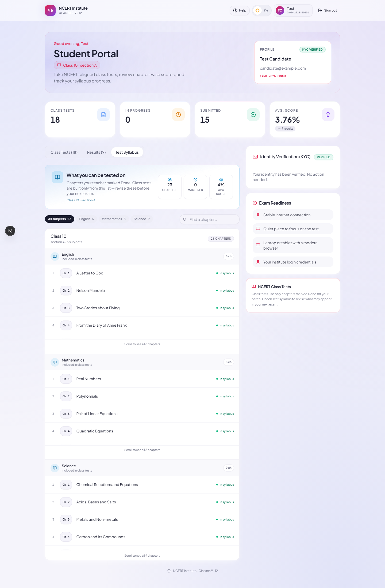

### What it does

**Chapter-wise progress** and performance: subjects, chapters, scores/mastery, weak areas.

### Main elements

| Element | Feature |
|---------|---------|
| **Subject filter** | All subjects or one subject |
| **Chapter search** | Find chapters quickly |
| **Chapter rows** | Number, title, progress/score indicators |
| **Topic breakdown** | Finer granularity where data exists |

### Workflow

Use after tests to see strong vs weak chapters; align self-study with class syllabus.

---

## End-to-end flow (all three roles)

```text
Super Admin:  Institutes → Books → Classes/Batches → Students → Syllabus progress
              → AI Create Test → Publish Class Test → Monitor → Publish Results
                    ↓ assigns
Teacher:      Topic Progress → AI Create Test → Publish → My Students → Results
                    ↓ publishes & enrolls
Candidate:    Class Tests tab → Admit card → Start exam → Results tab → Certificate
```

---

## Refreshing screenshots

Screenshots in this document were captured from a running local stack:

- Web: `pnpm --filter @cbt/web dev` (port **3002**)  
- API: `python run_dev.py` in `apps/api-fastapi` (port **8000**)

Regenerate images:

```bash
node scripts/capture-workflow-screenshots.mjs
```

Output folder: `docs/workflow-screenshots/`

---

## Related documentation

| Document | Topic |
|----------|--------|
| [08-rbac-permissions.md](./08-rbac-permissions.md) | Full permission matrix |
| [12-ui-wireframes.md](./12-ui-wireframes.md) | UI structure |
| [README.md](../README.md) | Install and run |
